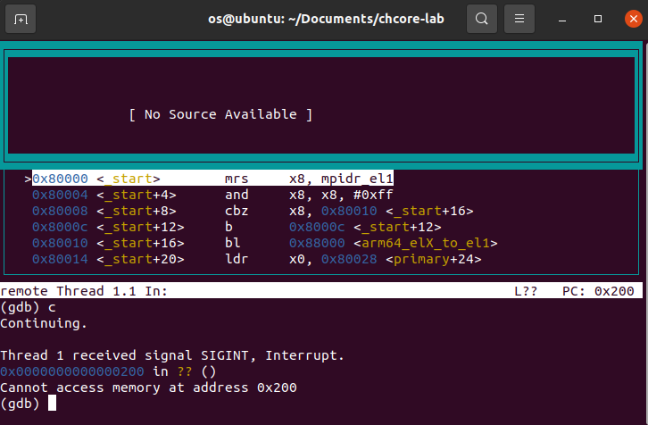

# 实验1

姓名: 黄嘉敏
学号: 520021911392

## 思考题

### 思考题1

`_start`开始代码如下,这段代码的目的是并让其他核暂停执行的：

```
mrs x8, mpidr_el1
and x8, x8, #0xFF
cbz x8, primary
b
```

这段汇编先将`mpidr_el1`放入`x8`中，再取出低8位，并且判断是否为0，如果时0，进入primary,否则被挂起。

### 思考题2

观察前后汇编发现应将当前异常级别写入`x9`寄存器，填写代码

```
mrs x9, CurrentEL
```

### 思考题3

根据上下汇编可知，`elr_el3`寄存器设置为`.Ltarget`。`spsr_el3`用于恢复程序状态，设置`SPSR_ELX_DAIF`以及`SPSR_ELX_EL1H`(屏蔽中断、设置内核栈)

验证: 使用make gdb验证可知能够退出`arm64_elX_to_el1`,返回`_start`.

### 思考题4

1. 对于参数传递，如果参数过多的时候，需要用到栈来传参，如果不设置启动栈，则无法调用有较多参数的函数。
2. 记录返回地址，寄存器保护，不设置会导致调用函数时需要额外寄存器保存返回地址，并在这种情况下如果有递归则会出现问题
3. 存储临时变量

### 思考题5

不清理`.bss`情况下，如果上次程序修改过对应全局变量，再次运行时会导致全局变量值变化，可能会导致指针越界。

### 思考题6

填写代码

``` C++
early_uart_init();
for (int i = 0; str[i] != '\0'; i++)
 early_uart_send((char) str[i]);
```

### 思考题7

填写代码

```
orr x8, x8, #SCTLR_EL1_M
```

打断后验证可得再`0x200`处无限循环。

